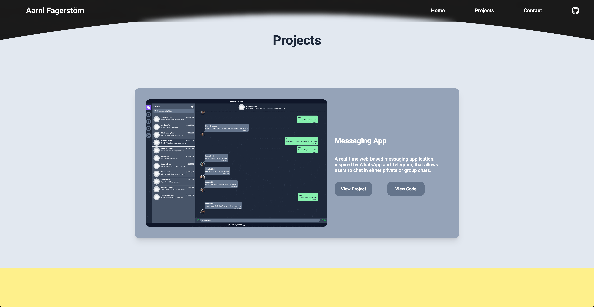
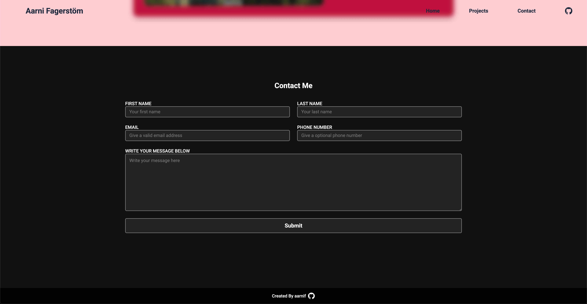

# Portfolio

My current portfolio page, that contains six different portfolio works and a contact form to get in touch with me.

## Live Preview

[PORTFOLIO](https://aarnif.github.io/portfolio/)

## Technologies

- CSS
- HTML
- FormSubmit (Contact form)

## Image


Image of the hero section.


Image of the first project.


Image of the contact section.

## Instructions

```
HTTPS - git clone https://github.com/aarnif/portfolio.git

SSH - git clone git@github.com:aarnif/portfolio.git

cd portfolio

Open the index.html file in your browser.
```
